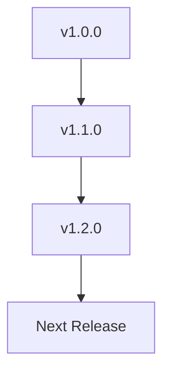

## Recent Updates

Stay informed about the latest releases in Henry Xiang's documentation space. You can review changes by version, including new features, improvements, bug fixes, and breaking changes. Use the expandable sections below for detailed release notes.



<Update label="2024-10-15" description="v1.2.0" tags={["feature", "bugfix"]}>

## New Features

- Added support for real-time collaboration in documentation pages, allowing multiple users to edit simultaneously.
- Introduced custom theming with brand color `#3B82F6` integration for personalized spaces.
- New API endpoints at `https://api.example.com/v1/docs` for programmatic documentation management.

## Improvements

- Enhanced search functionality with fuzzy matching and syntax highlighting in results.
- Optimized page load times by `>30%` through lazy loading of components.

## Bug Fixes

- Fixed rendering issues with nested code blocks inside JSX components.
- Resolved parsing errors when using special characters like `{` and `}` in prose.

````jsx
<CodeGroup tabs="JavaScript,Python">
```javascript
// Example usage of new API
const docs = await fetch('https://api.example.com/v1/docs', {
  headers: { Authorization: `Bearer ${YOUR_API_KEY}` }
});
```
```python
import requests
response = requests.get('https://api.example.com/v1/docs', 
                       headers={'Authorization': f'Bearer {YOUR_API_KEY}'})
```
</CodeGroup>
````

</Update>

<Update label="2024-09-20" description="v1.1.0" tags={["feature", "improvement"]}>

## New Features

- Implemented changelog tracking with `<Update>` components for better version history.
- Added Mermaid diagram support via code blocks for visualizing workflows.

## Improvements

- Improved mobile responsiveness for all documentation pages.
- Better accessibility with ARIA labels on interactive components like Tabs and Steps.

## Bug Fixes

- Corrected heading hierarchy enforcement to always start with H2 after frontmatter.
- Fixed attribute quoting issues in JSX components (double quotes now enforced).

</Update>

<Update label="2024-08-10" description="v1.0.0" tags={["feature", "breaking"]}>

## New Features

- Launched initial documentation space with MDX component support (Cards, Steps, Callouts, etc.).
- Core frontmatter parsing with title and description requirements.

## Breaking Changes

- Removed support for H1 headings; all pages must start with H2.
- Enforced escaping of special characters like `<` and `>` in prose.

## Improvements

- Added 5-8 component diversity requirement per page for rich documentation.

</Update>

## Upcoming Changes

<Expandable title="Preview v1.3.0 Features" default-open="false">

You can expect enhanced integration with external tools like GitHub for automatic changelog generation. Look for new `<Video>` and `<Iframe>` components for richer media embeds. A preview of the API schema will be available at `https://api.example.com/v1/docs/schema`.

<Callout kind="tip">
Test beta features by appending `?beta=true` to your documentation URLs.
</Callout>

</Expandable>

## Version Summary

| Version | Date       | Key Changes                  | Tags             |
|---------|------------|------------------------------|------------------|
| v1.2.0  | 2024-10-15 | Collaboration, API endpoints | feature, bugfix |
| v1.1.0  | 2024-09-20 | Changelog, Mermaid support   | feature, improvement |
| v1.0.0  | 2024-08-10 | Initial launch               | feature, breaking |

<Columns cols={3}>
  <Card title="Introduction" icon="book-open" href="/introduction">
    Get started with Henry Xiang's documentation space.
  </Card>
  <Card title="Quickstart" icon="rocket" href="/quickstart">
    Set up your first documentation page.
  </Card>
  <Card title="Authentication" icon="shield" href="/authentication">
    Secure your API access.
  </Card>
</Columns>

<Callout kind="info">
Subscribe to updates via the dashboard at `https://dashboard.example.com/notifications` to get notified of new releases.
</Callout>