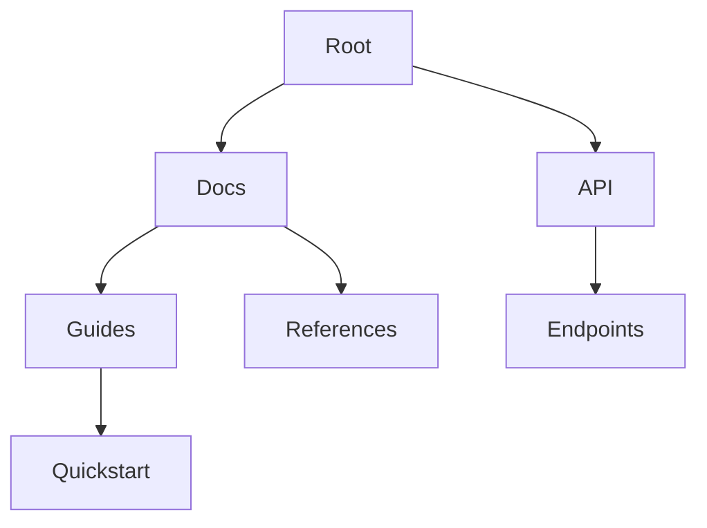

## Overview

Henry Xiang provides a comprehensive suite of tools to streamline your documentation workflow. You create, organize, track changes, and search content efficiently. These core features empower teams to maintain up-to-date docs without complexity.

<Callout kind="info">
  Start with the basics: create your first document using the intuitive editor.
</Callout>

## Key Features

Discover the essential capabilities at a glance.

<Columns cols={2}>
  <Card title="Document Creation & Editing" icon="edit-3" href="#document-creation">
    Build rich documents with visual and markdown editors.
  </Card>
  <Card title="Folder & Page Organization" icon="folder" href="#organization">
    Structure your docs hierarchically for easy navigation.
  </Card>
  <Card title="Version History Tracking" icon="git-branch" href="#version-history">
    Revert changes and collaborate with full audit trails.
  </Card>
  <Card title="Search & Filtering" icon="search" href="#search">
    Find content instantly across your documentation space.
  </Card>
</Columns>

## Document Creation and Editing

Create new documents from the dashboard. Click the `+ New Document` button and choose a template.

<Steps>
  <Step title="Start a New Doc" icon="plus">
    Select `Document` from the creation menu.
  </Step>
  <Step title="Edit Content" icon="edit">
    Use the WYSIWYG editor for quick formatting or switch to markdown mode.
  </Step>
  <Step title="Add Media" icon="image">
    Drag and drop images or embed videos directly.
  </Step>
  <Step title="Publish" icon="upload">
    Save and publish to make it live.
  </Step>
</Steps>

<Tabs>
  <Tab title="Visual Editor" icon="eye">
    Ideal for non-technical users. Format text, add headings, and insert components visually.
  </Tab>
  <Tab title="Markdown Editor" icon="code">
````markdown
# Welcome to Henry Xiang

## Quick Start

Install via npm:

```bash
npm install henry-xiang-sdk
```

Configure your API key: `HENRY_XIANG_API_KEY=your-key-here`.
````
  </Tab>
</Tabs>

## Folder and Page Organization

Organize content into folders and pages for scalability. Nest folders up to five levels deep.



| Organization Type | Description | Best For |
|-------------------|-------------|----------|
| Folders | Hierarchical containers | Large projects |
| Pages | Individual documents | Standalone guides |
| Subpages | Nested under pages | Tutorials with steps |

## Version History Tracking

Every edit creates a new version. Access history via the page menu.

<Expandable title="View Version Details" default-open="true">
  Compare changes side-by-side. Restore previous versions with one click.

  <CodeGroup tabs="CLI,UI">
    ```bash
    henry version list --page-id=doc-123
    henry version restore doc-123 v1.2
    ```
    ```javascript
    const versions = await henry.versions.list({ pageId: 'doc-123' });
    await henry.versions.restore('doc-123', 'v1.2');
    ```
  </CodeGroup>
</Expandable>

<Callout kind="tip">
  Enable auto-save to capture every change automatically.
</Callout>

## Search and Filtering Options

Search across all documents with advanced filters.

| Filter Type | Syntax Example | Result |
|-------------|----------------|--------|
| Full Text | `henry xiang features` | All matching pages |
| Folder | `folder:docs quickstart` | Guides in `/docs` |
| Tag | `tag:guide` | Tagged content |
| Date | `after:2024-01-01` | Recent updates |

Use these to pinpoint exact content quickly. Combine filters for precise results, like `folder:api tag:endpoint`.

<Columns cols={3}>
  <Card title="Next: Quickstart" icon="rocket" href="/quickstart">
    Build your first doc in minutes.
  </Card>
  <Card title="Authentication" icon="shield" href="/authentication">
    Secure your docs.
  </Card>
  <Card title="Changelog" icon="git-commit" href="/changelog">
    Stay updated.
  </Card>
</Columns>