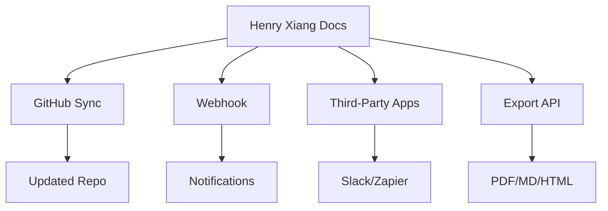

## Overview

Henry Xiang integrates seamlessly with popular tools to streamline your documentation workflow. You can synchronize changes from GitHub repositories, connect third-party apps like Slack for notifications, set up webhooks for real-time updates, and export docs to various formats. These integrations help you maintain up-to-date documentation without manual effort.

<Columns cols={3}>
  <Card title="GitHub Sync" icon="github" href="#github-synchronization">
    Automatically pull changes from your repos.
  </Card>
  <Card title="Third-Party Apps" icon="plug" href="#third-party-apps">
    Connect Slack, Zapier, and more.
  </Card>
  <Card title="Webhooks" icon="zap" href="#webhook-setup">
    Receive instant notifications on events.
  </Card>
</Columns>

## GitHub Synchronization

Sync your GitHub repositories with Henry Xiang to automatically update documentation when you push changes. This keeps your docs in sync with your codebase.

<Steps>
  <Step title="Connect GitHub" icon="github">
    In your Henry Xiang dashboard, navigate to Integrations > GitHub. Authorize the app to access your repositories.
  </Step>
  <Step title="Select Repository" icon="package">
    Choose the repo to sync. Henry Xiang watches for changes in the `docs/` folder.
  </Step>
  <Step title="Configure Branch" icon="git-branch">
    Specify the branch, typically `main`. Enable auto-build on push.
  </Step>
</Steps>

<Callout kind="tip">
  Use a dedicated `docs/` branch for documentation to avoid syncing code changes.
</Callout>

## Third-Party App Connections

Connect Henry Xiang to apps like Slack or Zapier for automated workflows.

<Tabs>
  <Tab title="Slack" icon="message-circle">
    Post updates to a Slack channel when docs publish.
    
    <CodeGroup tabs="JavaScript,cURL">
    ````javascript
    const slackData = {
      channel: "#docs-updates",
      text: "New docs published: https://docs.henryxiang.com/release-notes"
    };
    await fetch("https://slack.com/api/chat.postMessage", {
      method: "POST",
      headers: { "Authorization": `Bearer ${YOUR_SLACK_TOKEN}` },
      body: JSON.stringify(slackData)
    });
    ````
    ````bash
    curl -X POST https://slack.com/api/chat.postMessage \
      -H "Authorization: Bearer YOUR_SLACK_TOKEN" \
      -d '{"channel":"#docs-updates","text":"New docs published"}'
    ````
    </CodeGroup>
  </Tab>
  <Tab title="Zapier" icon="zap">
    Create Zaps to trigger actions on doc events.
    
    Use the webhook URL: `https://hooks.zapier.com/hooks/catch/YOUR_ZAP_ID/`
  </Tab>
</Tabs>

## Webhook Setup for Notifications

Set up webhooks to receive payloads on events like doc publishes or updates.

### Endpoint Configuration

Provide your webhook URL in Henry Xiang settings, such as `https://your-webhook-url.com/henryxiang`.

<ParamField header="X-HenryXiang-Signature" param-type="string" required="true">
  HMAC SHA-256 signature for verification. Use your secret: `YOUR_WEBHOOK_SECRET`.
</ParamField>

### Example Payload

<Response show-lines="true">
```json
{
  "event": "doc.published",
  "doc_id": "doc_123abc",
  "url": "https://docs.henryxiang.com/integrations",
  "timestamp": "2024-10-15T10:30:00Z"
}
```
</Response>

Verify the signature in your handler:

<CodeGroup tabs="Node.js,Python">
````javascript
const crypto = require("crypto");
const sig = req.headers["x-henryxiang-signature"];
const hmac = crypto.createHmac("sha256", "YOUR_WEBHOOK_SECRET");
hmac.update(JSON.stringify(req.body));
if (sig !== hmac.digest("hex")) {
  throw new Error("Invalid signature");
}
console.log("Verified webhook from Henry Xiang");
````
````python
import hmac
import hashlib
import json

payload = json.dumps(request.json, separators=(',', ':'))
signature = hmac.new(
    b"YOUR_WEBHOOK_SECRET",
    payload.encode(),
    hashlib.sha256
).hexdigest()

if request.headers.get("X-HenryXiang-Signature") != signature:
    raise ValueError("Invalid signature")
print("Verified webhook")
````
</CodeGroup>

<Callout kind="alert">
  Always verify webhook signatures to prevent unauthorized requests.
</Callout>

## Exporting Docs to Other Formats

Export your Henry Xiang documentation to PDF, Markdown, or HTML for sharing.

<Expandable title="Advanced Export Options" default-open="false">
  Use the API for bulk exports:
  
  ```bash
  curl -X POST https://api.example.com/v1/docs/export \
    -H "Authorization: Bearer YOUR_API_KEY" \
    -d '{"format": "pdf", "include_images": true}'
  ```
</Expandable>



These integrations make Henry Xiang a central hub for your documentation needs. Start with GitHub sync for immediate value.